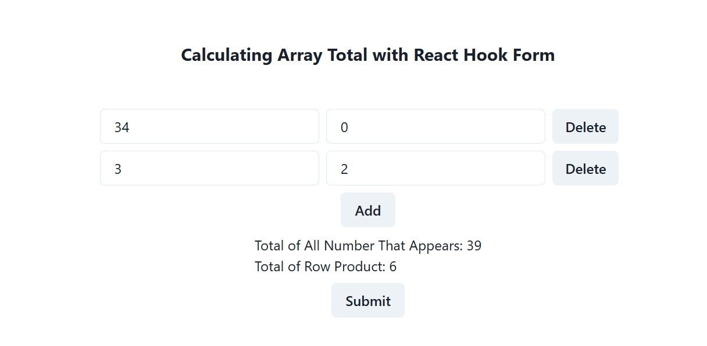

# Array Total - React Hook Form

In this project, we will use [react-hook-form](https://react-hook-form.com/) to create a dynamic array that receive number inputs. Then, we will need to perform some calculation on the array. 

For example, if we want to create an invoice form, we need the array total to be reflected as user make change to the form input. The submission button in the form is set to generate a `JSON` object containing all the fields in the array. This object can then be used for other purposes (For example, you want to store it in a database by performing API submit). 

## Demo


## Getting Started

First, run the development server:

```bash
npm run dev
# or
yarn dev
# or
pnpm dev
# or
bun dev
```

Open [http://localhost:3000](http://localhost:3000) with your browser to see the result.

You can start editing the page by modifying `app/page.tsx`. The page auto-updates as you edit the file.